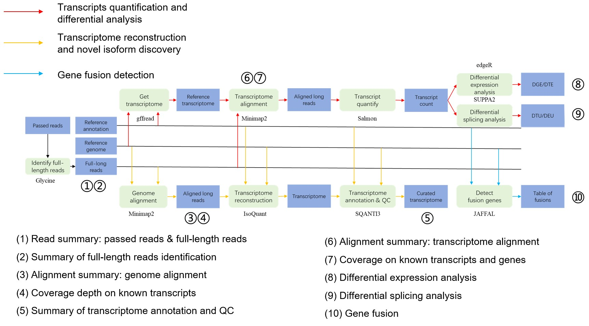

# Bulk全长转录组分析流程使用说明文档

## 基本介绍



该流程用于CycloneSEQ bulk 全长转录组分析，分析流程分为三个独立的模块：

**module1**：转录组重构与新型转录本鉴定（transcriptome reconstruction and novel isoform discovery）

**module2**：已知转录本的定量与差异表达/剪切分析（transcript quantification and differential expression/splicing analysis）

**module3**：融合基因检测（gene fusion detection）

默认执行这三个模块的分析任务，若用户只想执行其中的部分模块，可以通过修改配置文件`config.yaml`，进行对应模块的开启或关闭

## 安装与使用

### 安装
    
（1）安装miniconda，参考 [官方指导](https://docs.conda.io/projects/conda/en/latest/user-guide/install/linux.html) 完成安装
    
（2）将本流程的文件夹，拷贝到本地
    
（3）创建用于该分析流程的conda环境
    
 ```shell
conda env create -n pipeline_fulllong_transcriptome -f env.yaml
```

（4）SUPPA2的安装

```shell
wget -O SUPPA-2.4.tar.gz https://github.com/comprna/SUPPA/archive/refs/tags/v2.4.tar.gz
tar zxvf SUPPA-2.4.tar.gz
````

并修改config.yaml，以提供SUPPA的安装路径

```shell
SUPPA_HOME: "/PATH/TO/SUPPA-2.4"
```

（5）JAFFA的安装

JAFFA为用于融合基因检测的工具，其运行环境相对独特，需要为其专门创建conda环境，并在该环境中完成工具的安装，具体流程如下：

```shell
conda create -n jaffa_env python=3.8
conda activate jaffa_env
conda install -c bioconda bpipe=0.9.11 jaffa=2.3 minimap2=2.28

target_dir=$(which bpipe | xargs -n 1 dirname)
cp $target_dir/../share/jaffa-2.3-0/docker/tools.groovy $target_dir/../share/jaffa-2.3-0/
echo "make_3_gene_fusion_table='make_3_gene_fusion_table'" >> $target_dir/../share/jaffa-2.3-0/tools.groovy
for i in make_3_gene_fusion_table.c++ extract_seq_from_fasta.c++ make_simple_read_table.c++ process_transcriptome_align_table.c++;do g++ -std=c++11 -O3 -o $target_dir/$(basename $i .c++) $target_dir/../share/jaffa-2.3-0/src/$i;done

g++ -std=c++11 -O3 -o $target_dir/make_count_table $target_dir/../share/jaffa-2.3-0/src/make_count_table.c++
```

（6）SQANT3的安装

SQANT3为用于转录组注释与指控的工具，其运行环境相对独特，需要为其专门创建conda环境，并在该环境中完成工具的安装，具体流程如下：

```bash
wget -O SQANTI3-5.2.2.tar.gz https://github.com/ConesaLab/SQANTI3/archive/refs/tags/v5.2.2.tar.gz
tar zxvf SQANTI3-5.2.2.tar.gz
cd SQANTI3-5.2.2

conda env create -f SQANTI3.conda_env.yml

# 查看和测试该conda环境是否创建成功
conda env list # 查看是否存在SQANTI3.env的环境
conda activate SQANTI3.env # 激活SQANTI3.env的环境
```

（7）ggsashimi的安装

ggsashimi为用于差异可变剪切可视化的工具，其运行环境相对独特，需要为其专门创建conda环境，并在该环境中完成工具的安装，具体流程如下：

```shell
conda config --set channel_priority flexible
conda env create -n ggsashimi_env -f env.ggsashimi.yaml
```

（8）Glycine的安装

Glycine为CycloneSEQ自研的全长reads鉴定工具，可以从下机测序数据中，依据双端扩增引物（TSO & TRP）和polyA/T的序列组成及其相对结构，识别全长reads

由于获得的软件为可执行文件，只需将其保存到某个文件下，并将其加入环境变量即可

```shell
wget -c https://github.com/CycloneSEQ-Bioinformatics/Glycine/releases/download/v1.0.0/glycine.tar.gz
tar zxvf glycine.tar.gz
```   
    
### 输入
    
通用的输入文件，例如参考基因组等，和配置参数，由`config.yaml`文件指定：

输入文件的准备与指定

- （多个）目标物种的参考基因组序列和注释

    ```yaml
    reference:
        Human:
            fasta: "/data/resources/reference/hg38/Homo_sapiens.GRCh38.dna_sm.primary_assembly.fa"
            gtf: "/data/resources/reference/hg38/Homo_sapiens.GRCh38.113.primary_assembly.gtf"
            version: "hg38"
        Mouse:
            fasta: "/data/resources/reference/GRCm39/Mus_musculus.GRCm39.dna_sm.primary_assembly.fa"
            gtf: "/data/resources/reference/GRCm39/Mus_musculus.GRCm39.113.primary_assembly.gtf"
            version: "mm10"
        ...
    ```
     
    可以从NCBI、UCSC等数据库下载对应文件，并编辑`config.yaml`文件的对应项
  
- JAFFAL进行融合基因检测时，需要用到的参考文件的文件夹路径
    
    ```yaml
    jaffal_refBase: "/data/resources/reference/JAFFA_REFERENCE_FILES_HG38_GENCODE22.V2/"
    ```
    
    可以直接现在软件官方提供的已构建好的参考文件（仅提供人类hg38/hg19，和小鼠mm10下的）：[https://github.com/Oshlack/JAFFA/wiki/Download#reference-files](https://github.com/Oshlack/JAFFA/wiki/Download#reference-files)
    
    也可以按照软件官方提供的教程，自行从头构建参考文件：[https://github.com/Oshlack/JAFFA/wiki/FAQandTroubleshooting#how-can-i-generate-the-reference-files-for-a-non-supported-genome](https://github.com/Oshlack/JAFFA/wiki/FAQandTroubleshooting#how-can-i-generate-the-reference-files-for-a-non-supported-genome)
    
    注意：本流程提供的三个分析模块是相互独立的，可以选择行执行，若不准备进行融合基因检测，可以忽略该文件

### 配置参数设定

配置参数，在`config.yaml`文件中修改指定：

- `glycine_opts`：设定Glycine进行全长转录本鉴定的参数，默认为`-5 AAGCAGTGGTATCAACGCAGAGTACATGGG -3 AAGCAGTGGTATCAACGCAGAGTAC -e 0.25,0.4 -s 100,100 -L 0 -u 10 -l 10`
- `minimap_genome_index_opts`：设定minimap2构建参考基因组索引，以适用于转录本测序片段的剪切跳跃式比对，默认为`-x splice -k14`
- `minimap2_opts`：设定minimap2进行比对的参数，需要对基因组比对和转录组比对设定不同的参数，默认基因组比对参数为`-ax splice -uf -k14 --secondary=no`，转录组比对参数为`-ax map-ont --secondary=no`
- modules：设定三个分析模块的开启（True）或关闭（False）状态
    
    ```
    modules:
        module1: True # 转录组重构与新型转录本鉴定
        module2: True # 已知转录本的定量与差异表达分析
        module3: True # 融合基因检测
    ```

### 样本信息文件准备

信息文件（`read_manifest.tsv`）
    
根据实际样本信息，创建样本信息文件，要求包含以下4列：

- 第一列：run id
- 第二列：样本名，分析结果中将用此列进行样本标记。注意，请不要在命名中包含**空格**、**连字符**等非法字符，且不要以**数字**开头
- 第三列：样本分组，将对照组与实验组分别设为`control`和`treated`
- 第四列：测序数据保存路径，建议使用绝对路径

示例如下：

```
2407C01889011   control_1  control 2407C01889011.fastq.gz
2407C02530011   control_2  control 2407C02530011.fastq.gz
2407C02350011   control_3  control 2407C02350011.fastq.gz
2407C02217011   treated_1  treated 2407C02217011.fastq.gz
2407B02542021   treated_2  treated 2407B02542021.fastq.gz
2407C01579021   treated_3  treated 2407C01579021.fastq.gz
```
    
### 输出
    
数据预处理及指控输出：

- fl_reads/<sample_name>/*fq.gz
        
    全长reads鉴定结果，并包含下机数据与全长reads的长度和质量指控统计结果
        

模块1的输出：

- genome_index/
    
    minimap2构建的参考基因组索引
        
- genome_alignments/<sample_name>/*bam
    
    各样本数据用minimap2比对到参考基因组的比对输出结果
  
- known_transcripts_depth/
    
    其中的Profile.png，为已知转录本编码区间（不包括intron）及其上下游2kb区间的read覆盖深度分析结果
 
- isoquant/OUT/*transcript_models.gtf
    
    IsoQuant执行转录组重构得到的非冗余转录本结构
    
- sqanti_qc/
    
    使用SQANTI3，进行转录组重构结果的注释和QC的输出结果，其中的OUT.transcript_models_classification.txt是关键文件，这是一个以制表符分隔的文本文件，每行为一个转录本，各个列为SQANTI3给出的注释和QC指标，具体文件格式说明，请参考 [官方文档](https://github.com/ConesaLab/SQANTI3/wiki/Understanding-the-output-of-SQANTI3-QC#classifcols)


模块2的输出：

- transcriptome_index/{transcripts.fa, transcriptome_index.mmi}
    
    minimap2构建的参考转录组索引。参考转录组来源于提供的对应物种的基因组注释文件
   
- transcriptome_alignments/<sample_name>/*bam
    
    各样本数据用minimap2比对到参考转录组的比对输出结果
        
- known_transcripts_coverage/<sample_name>/coverage.tsv
    
    各样本数据对已知转录本和基因的覆盖情况，将基因分成protein_coding和lncRNA分别进行统计，文件格式如下
    
    ```
    gene_biotype   coverage          feature
    lncRNA         0.140303894436669 transcript
    protein_coding 0.440216948521282 transcript
    lncRNA         0.331156556109297 gene
    protein_coding 0.768564602826996 gene
    ```
        
- count_reads/<sample_name>/quant.sf
    
    用Salmon得到的各样本的转录本定量结果
     
- merge_counts/
    
    合并所有样本的转录本定量结果，得到的表达定量矩阵，定量单位为read count（all_counts.tsv）和TPM（all_TPM.tsv）
    
- diff_exp/
    
    用edgeR进行差异表达分析得到的结果，包含DGE（Differential Gene Expression）和DTE（Differential Transcript Expression）

模块3的输出：
    
- jaffal_fusion/<sample_name>/
    
    对应样本的融合基因鉴定结果，文件夹下包含两个文件`jaffa_results.csv`和`jaffa_results.fasta`，文件格式说明见 [官方文档](https://github.com/Oshlack/JAFFA/wiki/OutputDescription)

    jaffal_fusion/jaffa_results.csv为所有样本融合基因鉴定结果的汇总
        
### 使用
    
需要在前面创建的conda环境下进行本流程的分析

```shell
conda activate pipeline_fulllong_transcriptome
```

流程的具体用法如下：

```shell
snakemake \
--snakefile <path to Snakefile> \ # 指定Snake文件的路径
--configfile <path to config.yaml> \ # 指定config.yaml文件的路径
--config \
manifest=<path to manifest.tsv> \# 样本信息文件
specie=<specie> \                # 当前数据的物种，请与config.yaml中的物种名一致
with_ERCC=<True | False> \       # 是否为ERCC spike-in实验
--directory <output directory> \ # 指定输出目录
--use-conda \
-j <num_cores>                   # 指定最大运行CPU数
```

## 流程概览

### 1. 原始下机数据（passed reads）的预处理与全长reads鉴定

使用自研Glycine进行全长reads鉴定和拆分，Glycine会依据双端扩增引物（TSO & TRP）和polyA/T的序列组成及其相对结构，识别全长reads，并给出全长cDNA reads的统计结果。对于存在嵌合的reads，Glycine会尝试从中拆分出满足序列结构要求的全长reads。仅全长reads会被用于下游的分析。

此外，该部分还对原始下数据（passed reads）和全长reads数据（full-length reads）进行长度、质量和GC含量的质控统计。

### 2. 模块1：转录组重构与新型转录本鉴定

（1）将reads比对到参考基因组

使用minimap2构建参考基因组索引，并将各个样本的reads比对到参考基因组上。比对结果通过samtools处理得到排序索引后的bam文件。使用samtools对bam文件进行统计，以得到比对结果的统计。

（2）已知转录本编码区域的read覆盖深度及均匀性评估

具有给定的参考基因组注释文件（GTF文件），得到所有已知转录本编码区域。然后使用deeptools，进行已知转录本编码区域的read覆盖深度及均匀性评估。

（3）转录组重构与转录本注释、质控

使用IsoQuant完成参考基因组指导下的转录组重构。所有样本的比对结果会一起提供给IsoQuant，以得到一个综合所有样本信息的转录组重构结果。

转录组重构结果会提供给SQANTI3进行转录本结构注释和质控，通过将转录组重构结果与参考基因组注释的比较，以确定各个重构出的转录本相对注释中已知转录本结构的完整性，识别出新型转录本，并对转录本结构进行质量评估。

### 3. 模块2：已知转录本的定量与差异表达/剪切分析

（1）构建参考转录组

使用gffread基于给定的参考基因组注释（GTF）和参考基因组序列，从中提取出mRNA的序列，得到参考转录组。

（2）将reads比对到参考转录组

使用minimap2构建参考转录组索引，并将各个样本的reads比对到参考转录组上。比对结果通过samtools处理得到排序索引后的bam文件。使用samtools对bam文件进行统计，以得到比对结果的统计。

（3）已知基因（仅统计蛋白编码基因和lncRNA基因）的基因覆盖度和转录本覆盖度的统计

使用mosdepth基于各样本的参考转录组比对结果，得到各个转录本的覆盖度统计信息，并进行已知基因（仅统计蛋白编码基因和lncRNA基因）的基因覆盖度和转录本覆盖度的统计。

转录本覆盖度为，被覆盖的转录本在所有已知转录本的占比；基因覆盖度为，被覆盖的基因在所有已知基因的占比。转录本被覆盖的定义为一个转录本至少有80%的覆盖率，基因被覆盖的定义为该基因至少有一个转录本被覆盖。

（4）转录本定量

使用Salmon进行转录本的定量，得到各样本各转录本的定量结果，并合并所有样本的定量信息，得到转录本定量矩阵。

（5）差异表达分析

使用edgeR进行差异表达分析，包括差异基因表达（DGE）和差异转录本表达（DTE）。

（6）差异剪接分析

使用SUPPA2进行差异剪接分析。差异剪接分析在两个维度上进行：局部可变剪接事件，指基因中特定区域的可变剪接模式，如外显子跳跃（Skipped Exons, SE）、内含子保留（Retained Introns, RI）等，仅涉及基因的某一小段区域（如单个外显子或内含子）；转录本水平事件，关注整个转录本（isoform）的表达变化。

### 4. 模块3：融合基因检测

使用JAFFA进行融合基因的检测，各个样本的融合基因检测分析是独立进行的，分析结束后，会进行所有样本检测结果的汇总。